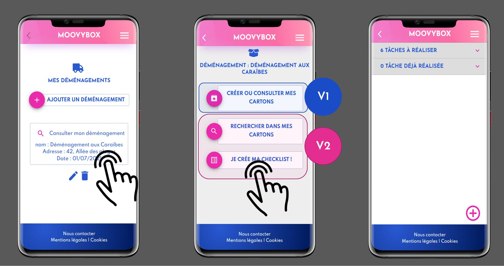

# Bienvenue dans le projet moovyBox !

## Pourquoi MoovyBox ?

L’objectif de notre projet Moovybox est de permettre à l’utilisateur de gérer son déménagement.

  - D’une part en lui permettant d’organiser ses tâches à réaliser avant, pendant et après son déménagement.

  - D’autre part, de gérer ses cartons, de saisir leur contenu, leur pièce de destination et surtout, lui permettre de retrouver sa cravate à pois bleu dans le carton n°115 à l’étage, dans sa chambre ! 

## Le cahier des charges

Nous avons commencé par élaborer le cahier des charges avec : 

  - Les définitions des objectifs,
  - du public visé,
  - du Minimum Viable Product MVC,
  - Les potentielles évolutions
  - L’arborescence,
  - Les Users Stories nécessaires dans un contexte Agile
  - Modèle conceptuel de données MCD 
  - Liste des routes. 

## Avec quelles techno ?

En frontend :
  - Axios pour la communication entre le navigateur et nodejs, 
  - Les bibliothèques javascript React et Redux,
  - la bibliothèque material-UI pour les composants react qu’elle fournit pour le rendu dans le DOM
  - la bibliothèque Formik associée à Yup pour la réalisation et la validation des formulaires
  - npm et yarn pour l’installation des packages et pour les notifications de vulnérabilité
  
Côté backend :

  - nodeJS qui comprend également un ensemble de modules dont bcrypt (hachage),
  - Le système de gestion de base de données relationnelle est PostgreSQL + framework d’application serveur EXPRESS. 
  - Gestion des sessions : express-session
  - PGadmin 4 et le simulateur de client : insomnia  
  
## Contexte de travail

Nous avons travaillé en équipe dans un contexte agile Scrum avec des réunions stand-up quotidiennes, des démos hebdomadaires et des outils tels
  - qu’un Kanban commun : trello pour s’organiser et s’adapter au fur et à mesure du projet,
  - Et Git outil libre de versionning 

## Captures de la page d'accueil du démémnagement, du menu des options et de la checkliste des tâches à réalisées ou déjà réalisées.

